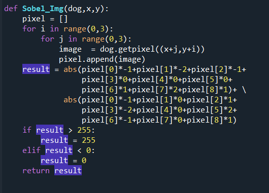

# **Image Enhancement**
學號:7109056202 

姓名:陳彥儒

1. 目的

本次的作業目的就是希望能使影像銳化，在不用函式庫的情況下達到銳化效果。

1. 實作流程

1. 實作
   0. 原始圖

0. 將原始圖轉灰階圖

![ref1]

0. 對(1)做二階微分(Laplacian)

因為Mask是3\*3的，所以我們使用getpixel()依序抓取原圖九個pixel值，如下所示:

|Pixel[0]|Pixel[1]|Pixel[2]|
| :-: | :-: | :-: |
|Pixel[3]|Pixel[4]|Pixel[5]|
|Pixel[6]|Pixel[7]|Pixel[8]|

那Laplacian的Mask如下所示:

|-1|-1|-1|
| :-: | :-: | :-: |
|-1|8|-1|
|-1|-1|-1|

讓兩者去做運算後把得到的result值回傳

把回傳過來的pixel依序填入Laplacian裡

因為對影像找edges使用Laplacian雖然可以讓edge的寬度=1pixel，但是它同時也讓平坦區的noise放大，所以改用一階微分來找edges。

0. 讓(1)原始圖和(2)Laplacian相加得到影像銳化的圖

使原始圖的每一個pixel和Laplacian\_Image的每一個pixel相加，得到影像銳化。

對影像找edges使用Laplacian雖然可以讓edge的寬度=1pixel，但是它同時也讓平坦區的noise放大，所以改用一階微分來找edges。

0. 對(1)原始圖做一階微分(sobel)

雖然一階微分有方向性，但是在影像處理不管方向，所以取絕對值。那Sobel同時要對x,y做處理，所以我們的Mask有兩個:

使原始圖和兩個Mask做運算後取絕對值相加後回傳result值

把回傳的pixel值依序填入Sobel裡，得到下圖

我們可以觀察到使用一階微分找edge真的會讓edge的寬度加大。

0. 讓(4)模糊化

模糊化的Mask如下所示:

使原始圖和Mask做運算後回傳result值

把回傳的result值依序填入Blur裡後得到下圖

0. 對(5)模糊影像作標準化在乘(2)Laplacian

將Blur的每個pixel除上255做標準化再乘Laplacian\_img的每個pixel，再依序填入Normal得到下圖:

0. 讓(6)和原始圖(灰階圖)相加得到銳利化效果

![ref2]

1. 實作結果

原始圖

![ref3]

經過銳化處理後

![ref2]

1. 實作心得

這次的作業非常有趣，以往如果要做銳利化肯定是到photoshop去做，現在即使不用opencv的function直接得到銳利效果，也可以一步一步手刻程式碼將效果實作出來，不僅可以真正去理解它是如何實作，

更可以驗證上課所學，例如:使用二階微分去找edge

，雖然寬度只有1pixel但是也真的把平坦區的

Noise同時放大，所以我們更傾向用一階微分去找edge。

[ref1]: Aspose.Words.1daa0a90-764d-4f5f-baed-2378dd613a2c.004.jpeg
[ref2]: Aspose.Words.1daa0a90-764d-4f5f-baed-2378dd613a2c.022.jpeg
[ref3]: Aspose.Words.1daa0a90-764d-4f5f-baed-2378dd613a2c.023.jpeg
